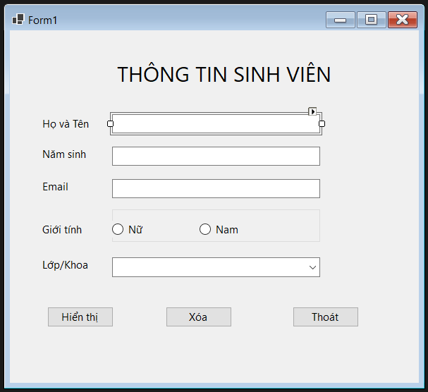
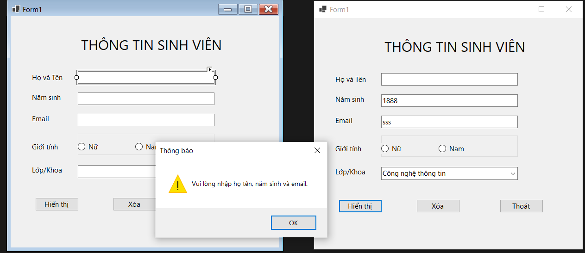
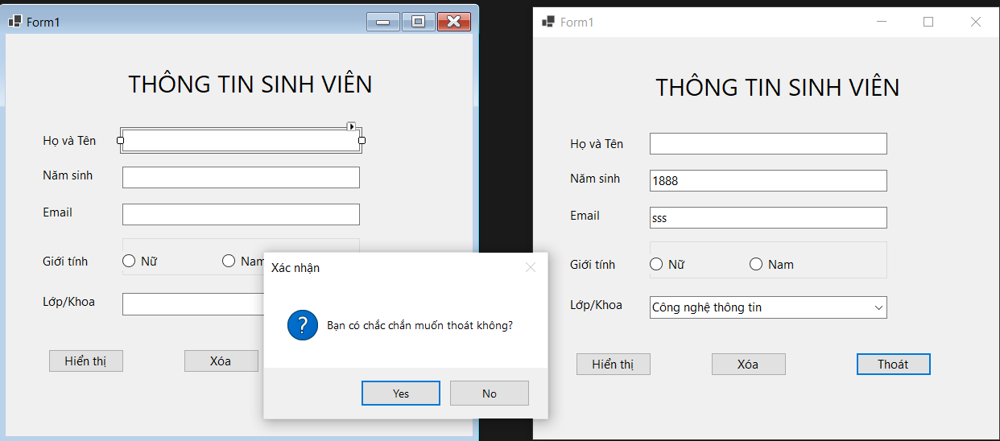

# Lab 01 - Ứng Dụng Thông Tin Cá Nhân

Ứng dụng desktop trên nền tảng **Windows Forms (C#)** hỗ trợ nhập liệu, kiểm tra tính hợp lệ và hiển thị thông tin chi tiết của sinh viên qua hộp thoại tương tác.

---

## 📌 Thông Tin Dự Án

| Thuộc tính | Chi tiết |
| :--- | :--- |
| **Môn học** | Lập trình Windows |
| **Công nghệ** | C# WinForms |
| **Framework** | .NET 10 |
| **Namespace** | `lab1` |
| **Form chính** | `Form1` |

---

## 🖥️ Giao Diện Ứng Dụng



---

## ⚙️ Các Chức Năng Chính

* **Khởi tạo dữ liệu (`Form1_Load`)**:
  * Tự động nạp 4 khoa vào `ComboBox`: *Công nghệ thông tin*, *Toán - Tin học*, *Vật lý*, *Hóa học*.
  * Mặc định chọn khoa đầu tiên (`SelectedIndex = 0`).
* **Nhập liệu sinh viên**:
  * Họ tên (`txtHoTen`).
  * Năm sinh (`txtNamSinh`).
  * Email (`txtEmail`).
  * Giới tính: Chọn giữa **Nam** (`rdoNam`) hoặc **Nữ** (`rdoNu`).
  * Khoa đào tạo: Chọn từ danh sách thả xuống (`cboKhoa`).
* **Xử lý & Hiển thị (`btnHienThi_Click`)**:
  * Thực hiện xác thực các trường nhập liệu trước khi tính toán.
  * Tự động tính tuổi theo công thức: `Tuổi = Năm hiện tại - Năm sinh`.
  * Xuất toàn bộ kết quả lên `MessageBox` dạng thông tin (`Information`).
* **Làm mới dữ liệu (`btnXoa_Click`)**:
  * Xóa trắng các ô nhập văn bản (`txtHoTen`, `txtNamSinh`, `txtEmail`).
  * Khôi phục giới tính mặc định về **Nam**.
  * Đặt lại khoa mặc định về mục đầu tiên.
  * Tự động trỏ con trỏ phím về ô Họ tên (`txtHoTen.Focus()`).
* **Đóng ứng dụng (`btnThoat_Click`)**:
  * Kích hoạt hộp thoại xác nhận trước khi tắt chương trình.

---

## 🛡️ Kiểm Tra Dữ Liệu (Validation)



Hệ thống áp dụng logic kiểm tra tuần tự qua các bước:

1. **Rỗng dữ liệu (`string.IsNullOrWhiteSpace`)**:
   * Kiểm tra đồng thời cả 3 ô: **Họ tên**, **Năm sinh**, **Email**.
   * *Thông báo khi vi phạm:* Hiển thị hộp thoại cảnh báo `Warning`: *"Vui lòng nhập họ tên, năm sinh và email."*
2. **Hợp lệ năm sinh (`int.TryParse`)**:
   * Chuỗi nhập vào phải chuyển đổi được sang số nguyên.
   * Năm sinh phải nằm trong phạm vi: `1900 <= namSinh <= DateTime.Now.Year`.
   * *Thông báo khi vi phạm:* Hiển thị thông báo lỗi `Error`, hủy xử lý và tự động focus lại vào ô nhập năm sinh (`txtNamSinh.Focus()`).

---

## ⚠️ Hộp Thoại Xác Nhận



* Khi người dùng chọn nút **Thoát**, sự kiện kích hoạt hộp thoại `MessageBoxButtons.YesNo`:
  * **Tiêu đề:** `Xác nhận`
  * **Nội dung:** `Bạn có chắc chắn muốn thoát không?`
  * **Biểu tượng:** `Question`
* Chương trình chỉ thực thi lệnh đóng toàn diện (`Application.Exit()`) khi chọn **Yes**.

---

## 🚀 Hướng Dẫn Cài Đặt & Chạy

### 1. Di chuyển vào thư mục dự án
```bash
cd "2611COMP101904-Lap-trinh-Windows\Lab01\Lab01_Ungdungthongtincanhan"
