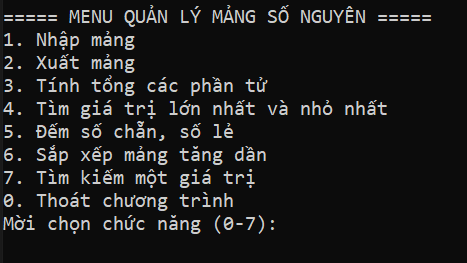
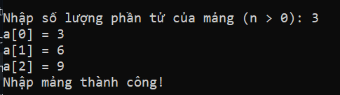
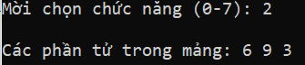
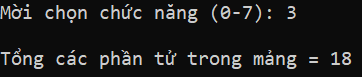
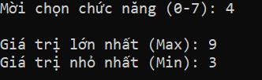
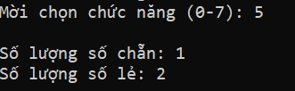
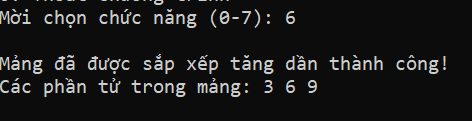
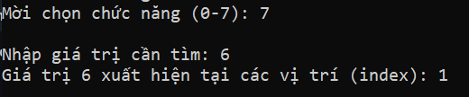
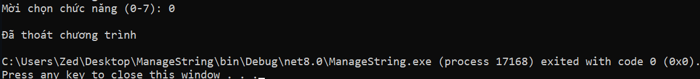

# Quản Lý Mảng Số Nguyên (Console C#)

Chương trình console nhỏ giúp bạn nhập và thực hiện các thao tác cơ bản trên một dãy số nguyên thông qua menu chọn số.

---

## Giao Diện Menu Chính

Hiển thị danh sách các phím bấm tương ứng với từng chức năng để người dùng lựa chọn.

---

## Các Chức Năng Chính

* **1. Nhập mảng**  
  Nhập số lượng phần tử và từng số trong dãy.  
  

* **2. Xuất mảng**  
  In toàn bộ các số vừa nhập ra màn hình.  
  

* **3. Tính tổng**  
  Cộng tất cả các số lại với nhau.  
  

* **4. Tìm số lớn nhất và nhỏ nhất**  
  Chỉ ra giá trị Max và Min trong dãy.  
  

* **5. Đếm số chẵn, số lẻ**  
  Đếm xem có bao nhiêu số chẵn và bao nhiêu số lẻ.  
  

* **6. Sắp xếp mảng tăng dần**  
  Xếp lại dãy số từ bé đến lớn và in ra kết quả.  
  

* **7. Tìm kiếm**  
  Nhập một số bất kỳ để xem nó nằm ở những vị trí nào.  
  

* **0. Thoát**  
  Tắt chương trình khi không sử dụng nữa.  
  

---

